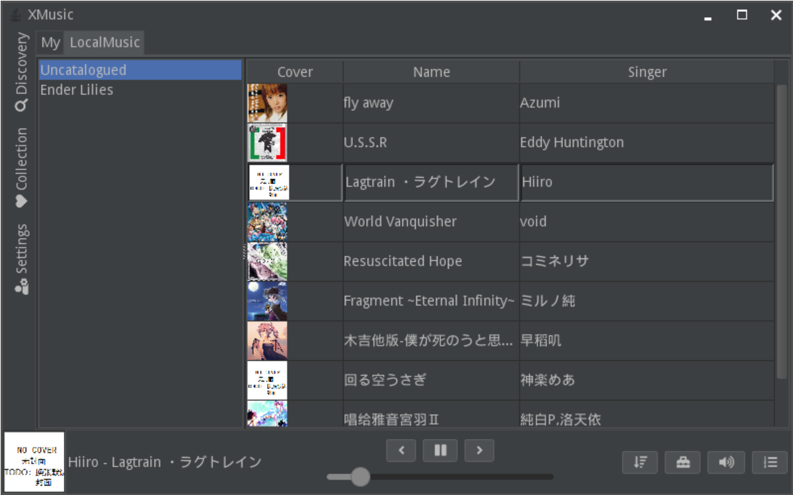

# X Music

**正在施工**

一个简单的音乐播放器，旨在能够通过“添加源”的方式播放不同地方的音乐。按照计划， 该应用将同时支持 Android 端和桌面端。

该项目被分为 3 个模块，分别为 `common`, `desktop` and `android`.

`common` 负责承担源管理，音乐下载，信息查询等功能。
`android` 和 `desktop` 仅提供界面和播放功能。

### 快照

图片仅为当前版本预览，不代表最终软件功能，

